# 🎬 NONTON – Your Personal Movie Journal  

## 📌 About  
**Nonton** is a simple yet powerful app designed to help you track and manage your favorite movies. Built with Jetpack Compose, it offers a seamless experience while fetching movie data from an API.

---

## ✨ Features  

- 🎥 **Add Notes** – Keep a record of the movies you've watched.  
- 📝 **Edit Notes** – Update your reviews and impressions anytime.  
- 🗑️ **Delete Notes** – Remove notes that are no longer needed.  
- 🎨 **Modern UI** – Designed with Jetpack Compose for a smooth and intuitive experience.  
- 🎭 **Fluid Animations** – Enjoy sleek transitions and interactions.  
- 🔔 **Toast Notifications** – Get quick feedback on your actions (add, edit, delete).  

---

## 🚀 Live Demo  

### **App Features in Action**  
Take a look at some of the stunning UI elements of Nonton!  

<div style="display: flex; flex-wrap: wrap; gap: 10px;">
  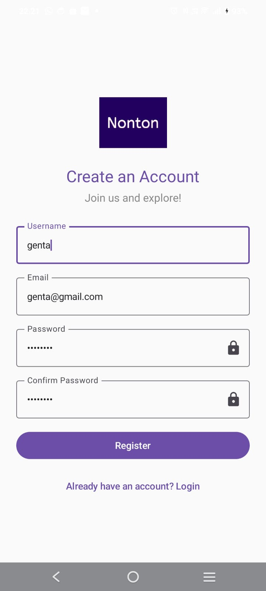
  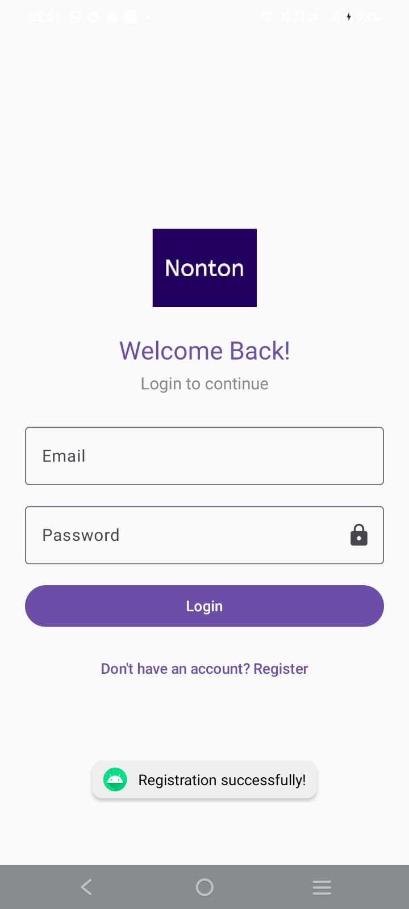
  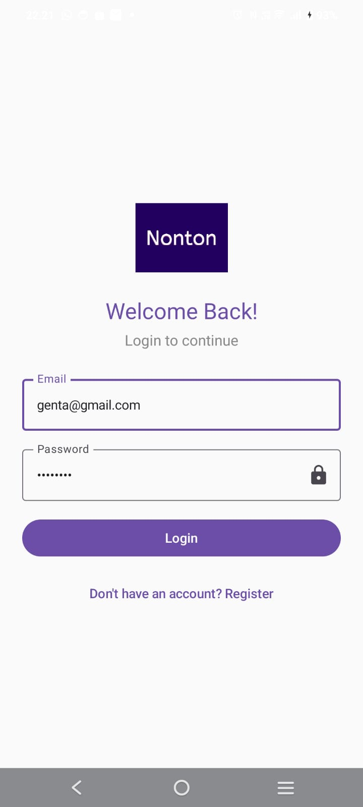
  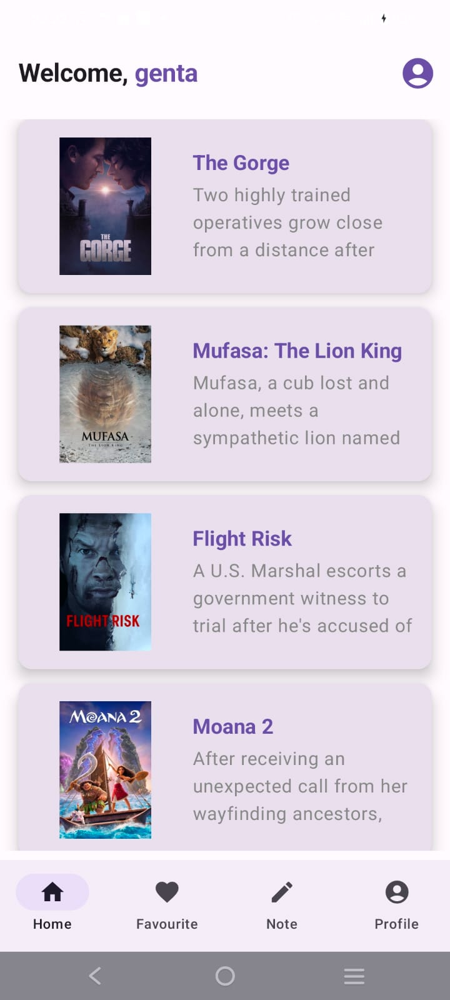
  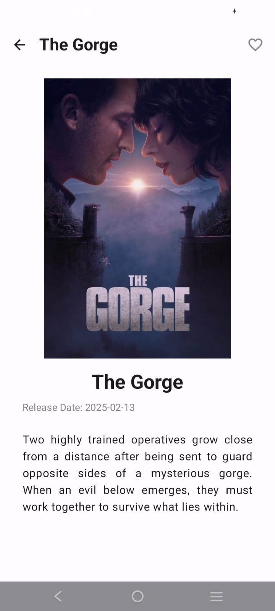
  
  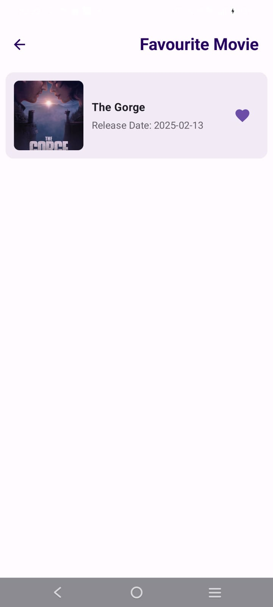
  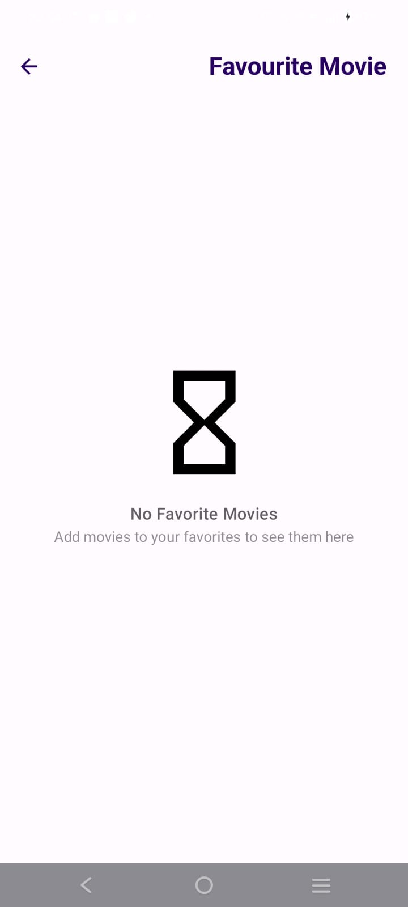
  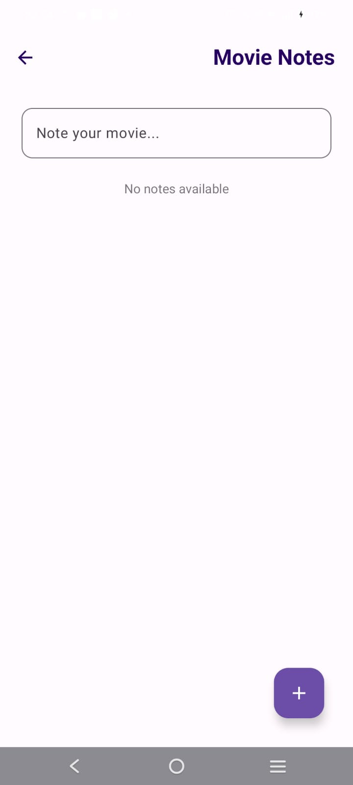
  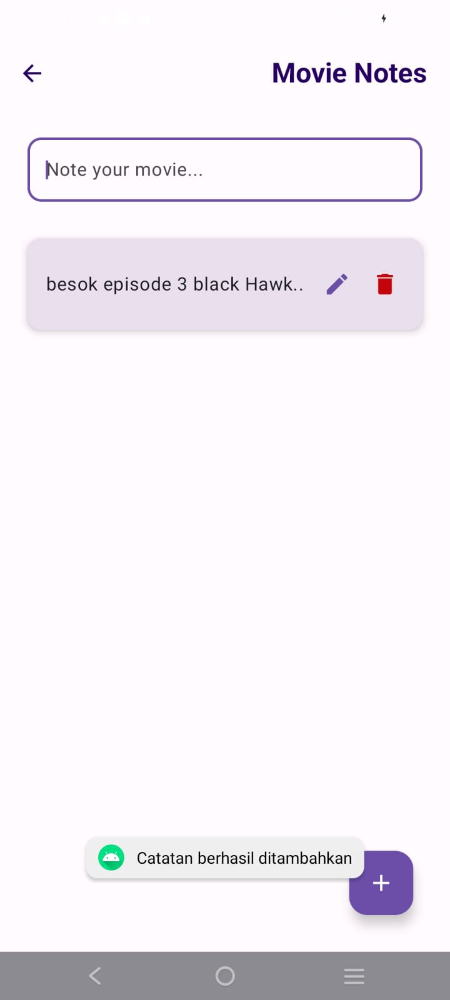
  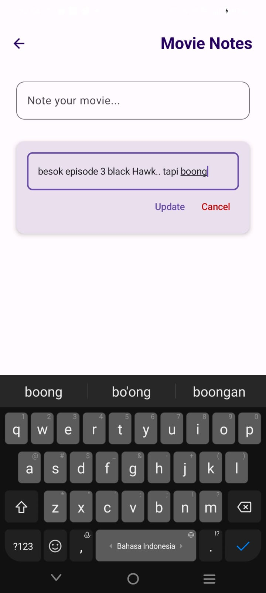
  
  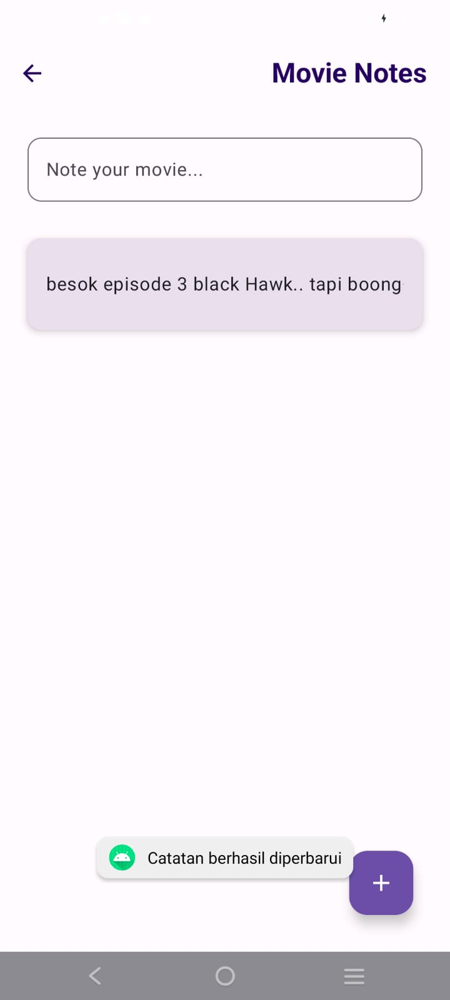
  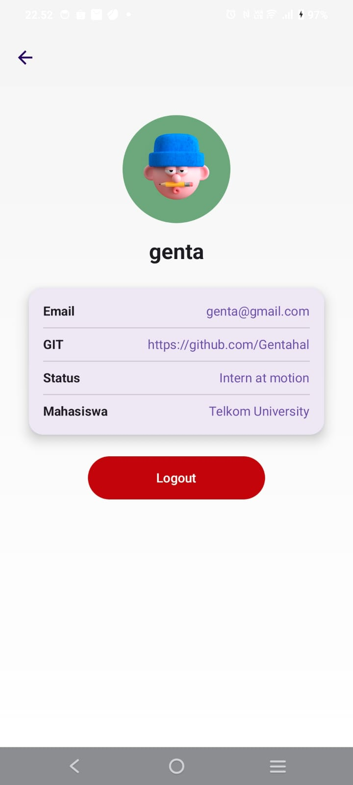
  
</div>  

---

## 🛠️ Installation  

1️⃣ **Clone the Repository**  
```bash
git clone https://github.com/username/nonton.git
```
  
2️⃣ **Open in Android Studio**  
- Import the project into Android Studio.  

3️⃣ **Build & Run**  
- Click **Run** in Android Studio or use the command:  
```bash
./gradlew assembleDebug
```
  
4️⃣ **Install the APK**  
- If you have an APK file, install it on your device via:  
```bash
adb install app-debug.apk
```

---

## 🎯 How to Use  

1️⃣ **Launch the App**  
- Open **Nonton** on your Android device.  

2️⃣ **Add a Movie Note**  
- Tap the `+` button at the bottom right.  
- Enter your review and save it.  

3️⃣ **Edit a Note**  
- Tap the `Edit` icon on any note.  
- Modify the content and hit `Update`.  

4️⃣ **Delete a Note**  
- Tap the `Delete` icon to remove an entry.  
- The note will be permanently deleted.  

---

🚀 **Enjoy the Experience & Happy Watching!** 🍿  

---

📌 **Note:** This repository is part of a major project for **Motion Lab**.
